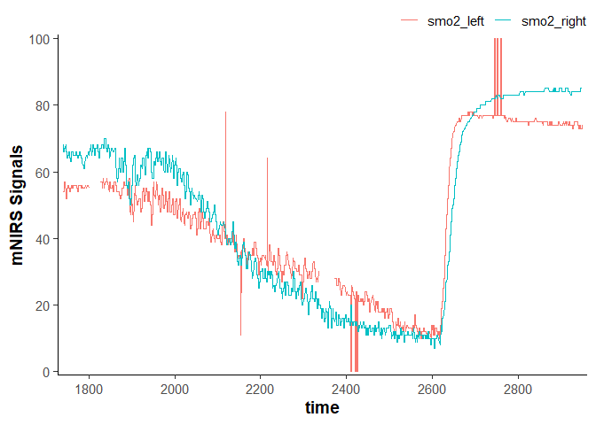
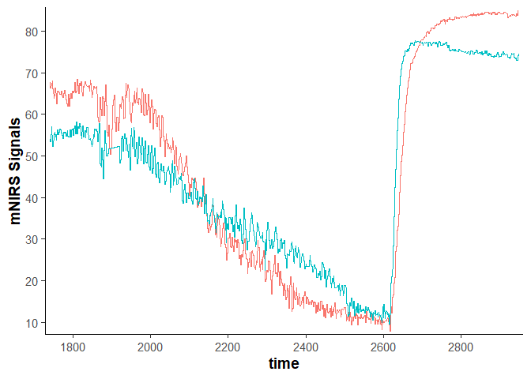
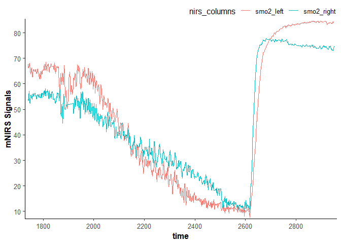
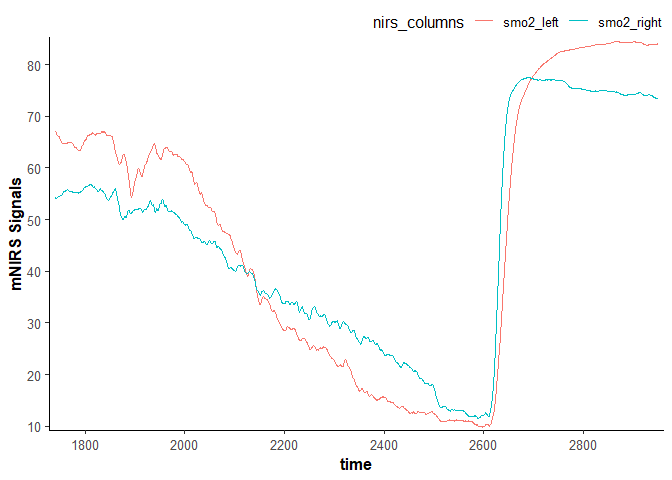
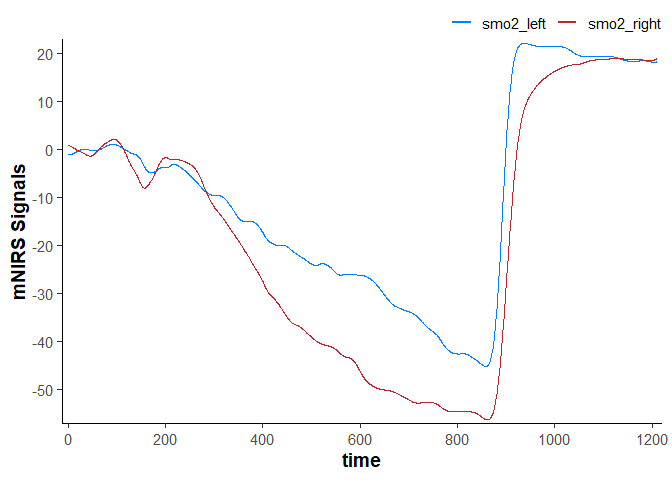
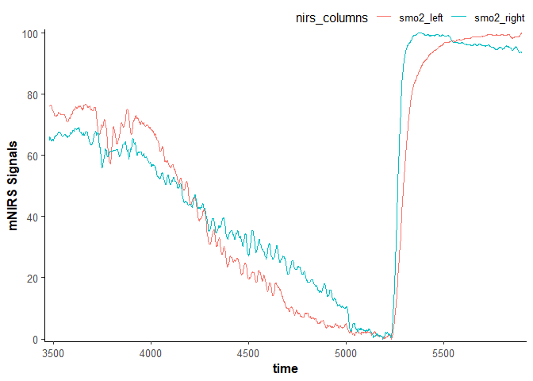

<!-- README.md is generated from README.Rmd. Please edit that file -->

# mNIRS

<!-- # mNIRS  -->

<!-- badges: start -->

<!-- badges: end -->

`mNIRS` is a package to allow for importing, processing, and analysing
data from muscle near-infrared spectroscopy (mNIRS) devices.

## Installation

You can install the development version of `mNIRS` from
[GitHub](https://github.com/jemarnold/mNIRS) with:

``` r
# install.packages("remotes")
devtools::install_github("jemarnold/mNIRS")
```

## Citation

…

## Usage

### Read data from file

``` r
library(mNIRS)

## {mNIRS} includes some sample files from Moxy and Train.Red
file_path <- system.file("moxy_ramp_example.xlsx", package = "mNIRS")

## rename columns in the format "new_name" = "original_name"
## where "original_name" should match the file column name exactly
data_raw <- read_data(file_path = file_path,
                      nirs_columns = c(smo2_left = "smo2_left_VL",
                                       smo2_right = "smo2_right_VL"),
                      sample_column = c(time = "Time"),
                      event_column = c(event = "Event"),
                      .keep_all = TRUE,
                      .verbose = TRUE)
#> Warning: "sample_column = time" has non-sequential or repeating values. Consider
#> investigating at "time = 1952, 1952, 1952, 2924.01, and 2924.01".
#> ℹ Estimated sample rate = 2 Hz.

data_raw
#> # A tibble: 2,203 × 4
#>     time event smo2_left smo2_right
#>    <dbl> <chr>     <dbl>      <dbl>
#>  1 1740. <NA>       67.6       54  
#>  2 1740. <NA>       67.6       54  
#>  3 1741. <NA>       67.6       54  
#>  4 1742. <NA>       66.3       53.5
#>  5 1742. <NA>       66.3       53.5
#>  6 1743. <NA>       66.3       53.5
#>  7 1743. <NA>       66.3       53.5
#>  8 1744. <NA>       67.2       57.1
#>  9 1744. <NA>       67.2       57.1
#> 10 1745. <NA>       67.2       57.1
#> # ℹ 2,193 more rows

plot(data_raw)
```



### Replace fixed values, outliers, and missing values

``` r
library(dplyr)
#> 
#> Attaching package: 'dplyr'
#> The following objects are masked from 'package:stats':
#> 
#>     filter, lag
#> The following objects are masked from 'package:base':
#> 
#>     intersect, setdiff, setequal, union

## metadata are stored in dataframe attributes
nirs_columns <- attributes(data_raw)$nirs_columns
sample_rate <- attributes(data_raw)$sample_rate

data_cleaned <- data_raw |> 
    mutate(
        across(any_of(nirs_columns), 
               \(.x) replace_fixed_values(x = .x,
                                          fixed_values = c(0, 100),
                                          width = 20 * sample_rate,
                                          return = "NA")
        ),
        across(any_of(nirs_columns), 
               \(.x) replace_outliers(x = .x,
                                      width = 20 * sample_rate, ## 20 sec median window
                                      t0 = 3,
                                      na.rm = TRUE,
                                      return = "median")
        ),
        across(any_of(nirs_columns), 
               \(.x) replace_missing_values(x = .x,
                                            method = "linear",
                                            na.rm = FALSE,
                                            maxgap = Inf)
        ),
    )

data_cleaned
#> # A tibble: 2,203 × 4
#>     time event smo2_left smo2_right
#>    <dbl> <chr>     <dbl>      <dbl>
#>  1 1740. <NA>       67.6       54  
#>  2 1740. <NA>       67.6       54  
#>  3 1741. <NA>       67.6       54  
#>  4 1742. <NA>       66.3       53.5
#>  5 1742. <NA>       66.3       53.5
#>  6 1743. <NA>       66.3       53.5
#>  7 1743. <NA>       66.3       53.5
#>  8 1744. <NA>       67.2       57.1
#>  9 1744. <NA>       67.2       57.1
#> 10 1745. <NA>       67.2       57.1
#> # ℹ 2,193 more rows

plot(data_cleaned)
```



### Resample data

``` r

sample_column <- attributes(data_cleaned)$sample_column

data_resampled <- data_cleaned |> 
    downsample_data(sample_column = sample_column,
                       sample_rate = sample_rate,
                       downsample_rate = 1) ## downsample to 1 Hz
#> ℹ Estimated sample rate is 2 Hz. Output is downsampled at 1 Hz.

data_resampled
#> # A tibble: 1,209 × 4
#>     time smo2_left smo2_right event
#>    <dbl>     <dbl>      <dbl> <chr>
#>  1  1740      67.6       54   <NA> 
#>  2  1741      66.3       53.5 <NA> 
#>  3  1742      66.3       53.5 <NA> 
#>  4  1743      66.8       55.3 <NA> 
#>  5  1744      67.2       57.1 <NA> 
#>  6  1745      67.6       55.2 <NA> 
#>  7  1746      68         53.2 <NA> 
#>  8  1747      67.1       52.8 <NA> 
#>  9  1748      66.2       52.3 <NA> 
#> 10  1749      65.1       53.7 <NA> 
#> # ℹ 1,199 more rows

plot(data_resampled)
```



### Filter (smooth) data

``` r
data_filtered <- data_resampled |> 
    mutate(
        across(any_of(nirs_columns),
               \(.x) filter_data(x = .x,
                                 method = "moving-average",
                                 width = 15)
        )
    )

data_filtered
#> # A tibble: 1,209 × 4
#>     time smo2_left smo2_right event
#>    <dbl>     <dbl>      <dbl> <chr>
#>  1  1740      67.1       54.3 <NA> 
#>  2  1741      67.0       54.1 <NA> 
#>  3  1742      66.8       54.0 <NA> 
#>  4  1743      66.5       54.1 <NA> 
#>  5  1744      66.4       54.3 <NA> 
#>  6  1745      66.2       54.4 <NA> 
#>  7  1746      66.2       54.5 <NA> 
#>  8  1747      66.2       54.5 <NA> 
#>  9  1748      66.0       54.5 <NA> 
#> 10  1749      65.8       54.6 <NA> 
#> # ℹ 1,199 more rows

plot(data_filtered)
```



### Shift and rescale data

``` r
data_shifted <- data_filtered |> 
    ## wrap `nirs_columns` vector in list to shift all columns together
    shift_data(nirs_columns = list(nirs_columns), 
                    shift_to = 0,
                    position = "first",
                    mean_samples = 30) ## shift the mean first 30 sec equal to zero

data_shifted
#> # A tibble: 1,209 × 4
#>     time smo2_left smo2_right event
#>    <dbl>     <dbl>      <dbl> <chr>
#>  1  1740      6.91      -5.88 <NA> 
#>  2  1741      6.81      -6.10 <NA> 
#>  3  1742      6.62      -6.14 <NA> 
#>  4  1743      6.35      -6.05 <NA> 
#>  5  1744      6.16      -5.94 <NA> 
#>  6  1745      6.03      -5.82 <NA> 
#>  7  1746      5.97      -5.74 <NA> 
#>  8  1747      5.98      -5.69 <NA> 
#>  9  1748      5.82      -5.65 <NA> 
#> 10  1749      5.66      -5.63 <NA> 
#> # ℹ 1,199 more rows

plot(data_shifted)
```



``` r

data_rescaled <- data_filtered |> 
    ## convert `nirs_columns` vector to list to shift each column separately
    rescale_data(nirs_columns = as.list(nirs_columns), 
                        rescale_range = c(0, 100))

data_rescaled
#> # A tibble: 1,209 × 4
#>     time smo2_left smo2_right event
#>    <dbl>     <dbl>      <dbl> <chr>
#>  1  1740      76.7       64.9 <NA> 
#>  2  1741      76.6       64.6 <NA> 
#>  3  1742      76.3       64.5 <NA> 
#>  4  1743      76.0       64.6 <NA> 
#>  5  1744      75.7       64.8 <NA> 
#>  6  1745      75.5       65.0 <NA> 
#>  7  1746      75.5       65.1 <NA> 
#>  8  1747      75.5       65.2 <NA> 
#>  9  1748      75.2       65.2 <NA> 
#> 10  1749      75.0       65.3 <NA> 
#> # ℹ 1,199 more rows

plot(data_rescaled)
```



### Process kinetics

> under development

## mNIRS Device Compatibility

This package is designed to recognise mNIRS data exported as *.xlsx*,
*.xls*, or *.csv* files. It should be flexible for use with many
different mNIRS devices, and compatibility will improve with continued
development.

This package have been tested successfully with the following mNIRS
devices:

- [Moxy](https://www.moxymonitor.com/) 5 and 3
- [Train.Red](https://train.red/) FYER and Plus
- [Artinis](https://www.artinis.com/nirs-devices) Portamon and Oxymon

This package have been tested successfully with mNIRS data exported from
the following devices and apps:

- [Moxy](https://www.moxymonitor.com/) onboard export (.csv)
- [Train.Red](https://train.red/) app (.csv)
- [Artinis Oxysoft](https://www.artinis.com/oxysoft) software (.csv and
  .xlsx)
- [VO2 Master Manager](https://vo2master.com/features/) app (.xlsx)
- [PerfPro](https://perfprostudio.com/) software (.xlsx)
