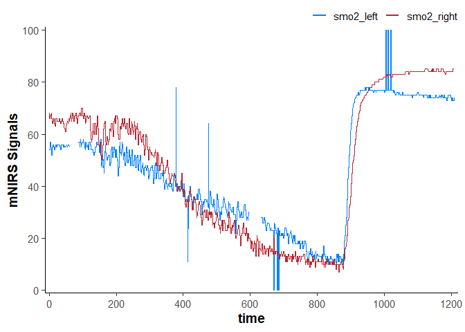

<!-- README.md is generated from README.Rmd. Please edit that file -->

# mNIRS

<!-- # mNIRS  -->

<!-- badges: start -->

[](https://github.com/jemarnold/mNIRS/actions/workflows/R-CMD-check.yaml)
<!-- badges: end -->

`{mNIRS}` is a package to allow for importing, processing, and analysing
data from muscle near-infrared spectroscopy (mNIRS) devices.

## Installation

You can install the development version of `{mNIRS}` from
[GitHub](https://github.com/jemarnold/mNIRS) with:

``` r
# install.packages("remotes")
devtools::install_github("jemarnold/mNIRS")
```

## Citation

…

## Online App

A very basic implementation of this package is hosted at
<https://jem-arnold.shinyapps.io/mNIRS-app/> and can be used for mNIRS
data importing and cleaning.

## Usage

### Read data from file

``` r

library(dplyr, warn.conflicts = FALSE)  ## load for data wrangling
library(ggplot2) ## load for plotting
library(mNIRS)

## {mNIRS} includes sample files from a few NIRS devices
file_path <- system.file("extdata/moxy_ramp_example.xlsx", package = "mNIRS")

## rename columns in the format `new_name1 = "file_column_name1"`
## where "file_column_name1" should match the file column name exactly
data_raw <- read_data(file_path,
                      nirs_columns = c(smo2_left = "SmO2 Live",
                                       smo2_right = "SmO2 Live(2)"),
                      sample_column = c(time = "hh:mm:ss"),
                      event_column = c(lap = "Lap"),
                      sample_rate = 2,
                      time_to_numeric = TRUE,
                      time_from_zero = TRUE,
                      keep_all = FALSE,
                      verbose = FALSE)

data_raw
#> # A tibble: 2,203 × 4
#>     time   lap smo2_left smo2_right
#>    <dbl> <dbl>     <dbl>      <dbl>
#>  1  0        1        54         68
#>  2  0.4      1        54         68
#>  3  0.96     1        54         68
#>  4  1.51     1        54         66
#>  5  2.06     1        54         66
#>  6  2.61     1        54         66
#>  7  3.16     1        54         66
#>  8  3.71     1        57         67
#>  9  4.26     1        57         67
#> 10  4.81     1        57         67
#> # ℹ 2,193 more rows

plot(data_raw)
```



### Replace outliers, invalid values, and missing Values

``` r

## metadata are stored in dataframe attributes
nirs_columns <- attributes(data_raw)$nirs_columns
sample_rate <- attributes(data_raw)$sample_rate

data_cleaned <- data_raw |> 
    mutate(
        across(any_of(nirs_columns), 
               \(.x) replace_invalid(x = .x,
                                     values = c(0, 100),
                                     return = "NA")
        ),
        across(any_of(nirs_columns), 
               \(.x) replace_outliers(x = .x,
                                      width = 15, ## 15 sample median window
                                      t0 = 3,
                                      na.rm = TRUE,
                                      return = "median")
        ),
        across(any_of(nirs_columns), 
               \(.x) replace_missing(x = .x,
                                     method = "linear",
                                     na.rm = FALSE,
                                     maxgap = Inf)
        ),
    )

data_cleaned
#> # A tibble: 2,203 × 4
#>     time   lap smo2_left smo2_right
#>    <dbl> <dbl>     <dbl>      <dbl>
#>  1  0        1        54         68
#>  2  0.4      1        54         68
#>  3  0.96     1        54         68
#>  4  1.51     1        54         66
#>  5  2.06     1        54         66
#>  6  2.61     1        54         66
#>  7  3.16     1        54         66
#>  8  3.71     1        57         67
#>  9  4.26     1        57         67
#> 10  4.81     1        57         67
#> # ℹ 2,193 more rows

plot(data_cleaned)
```


### Resample data

``` r

data_downsampled <- data_cleaned |> 
    resample_data(sample_column = NULL, ## will be automatically read from metadata
                    sample_rate = NULL, ## will be automatically read from metadata
                    resample_time = 10) ## equal to `resample_rate = 0.1`
#> Warning in regularize.values(x, y, ties, missing(ties), na.rm = na.rm):
#> collapsing to unique 'x' values
#> Warning in regularize.values(x, y, ties, missing(ties), na.rm = na.rm):
#> collapsing to unique 'x' values
#> Warning in regularize.values(x, y, ties, missing(ties), na.rm = na.rm):
#> collapsing to unique 'x' values
#> ℹ `sample_rate` = 2 Hz.
#> ℹ Output is resampled at 0.1 Hz.

data_downsampled
#> # A tibble: 121 × 4
#>     time   lap smo2_left smo2_right
#>    <dbl> <dbl>     <dbl>      <dbl>
#>  1     0     1      54           68
#>  2    10     1      55           64
#>  3    20     1      56           66
#>  4    30     1      56           65
#>  5    40     1      56           65
#>  6    50     1      55           62
#>  7    60     1      55           65
#>  8    70     1      55.7         68
#>  9    80     1      56.5         67
#> 10    90     1      57           68
#> # ℹ 111 more rows

plot(data_downsampled)
```


### Filter (smooth) data

``` r
data_filtered <- data_cleaned |> 
    mutate(
        across(any_of(nirs_columns),
               \(.x) filter_data(x = .x,
                                 method = "butterworth",
                                 type = "low",
                                 n = 2, ## see ?filter_data for details on filter parameters
                                 W = 0.02)
        )
    )

data_filtered
#> # A tibble: 2,203 × 4
#>     time   lap smo2_left smo2_right
#>    <dbl> <dbl>     <dbl>      <dbl>
#>  1  0        1      54.5       66.2
#>  2  0.4      1      54.5       66.2
#>  3  0.96     1      54.5       66.2
#>  4  1.51     1      54.5       66.2
#>  5  2.06     1      54.5       66.2
#>  6  2.61     1      54.5       66.1
#>  7  3.16     1      54.5       66.1
#>  8  3.71     1      54.5       66.1
#>  9  4.26     1      54.5       66.1
#> 10  4.81     1      54.5       66.1
#> # ℹ 2,193 more rows

plot(data_filtered)
```


### Shift and rescale data

``` r
data_shifted <- data_filtered |> 
    ## convert `nirs_columns` to separate list items to shift each column separately
    shift_data(nirs_columns = as.list(nirs_columns),
               shift_to = 0,
               position = "first",
               mean_samples = 120 * sample_rate) ## shift the mean first 120 sec equal to zero

data_shifted
#> # A tibble: 2,203 × 4
#>     time   lap smo2_left smo2_right
#>    <dbl> <dbl>     <dbl>      <dbl>
#>  1  0        1     -1.13      0.806
#>  2  0.4      1     -1.14      0.796
#>  3  0.96     1     -1.14      0.783
#>  4  1.51     1     -1.14      0.769
#>  5  2.06     1     -1.14      0.753
#>  6  2.61     1     -1.14      0.735
#>  7  3.16     1     -1.13      0.715
#>  8  3.71     1     -1.13      0.694
#>  9  4.26     1     -1.12      0.671
#> 10  4.81     1     -1.11      0.646
#> # ℹ 2,193 more rows

plot(data_shifted)
```


``` r
data_rescaled <- data_filtered |> 
    ## convert `nirs_columns` vector to separate list items to shift each column separately
    rescale_data(nirs_columns = as.list(nirs_columns), 
                 rescale_range = c(0, 100)) ## rescale to a 0-100% functional exercise range

data_rescaled
#> # A tibble: 2,203 × 4
#>     time   lap smo2_left smo2_right
#>    <dbl> <dbl>     <dbl>      <dbl>
#>  1  0        1      65.5       75.8
#>  2  0.4      1      65.5       75.8
#>  3  0.96     1      65.5       75.8
#>  4  1.51     1      65.5       75.8
#>  5  2.06     1      65.5       75.8
#>  6  2.61     1      65.5       75.7
#>  7  3.16     1      65.5       75.7
#>  8  3.71     1      65.5       75.7
#>  9  4.26     1      65.5       75.7
#> 10  4.81     1      65.5       75.6
#> # ℹ 2,193 more rows

plot(data_rescaled)
```


### Process kinetics

`<under development>`

## mNIRS Device Compatibility

This package is designed to recognise mNIRS data exported as *.xlsx*,
*.xls*, or *.csv* files. It should be flexible for use with many
different mNIRS devices, and compatibility will improve with continued
development.

This package have been tested successfully with the following mNIRS
devices:

- [Artinis](https://www.artinis.com/nirs-devices) Portamon and Oxymon
- [Moxy](https://www.moxymonitor.com/) 5 and 3
- [Train.Red](https://train.red/) FYER and Plus

This package have been tested successfully with mNIRS data exported from
the following devices and apps:

- [Artinis Oxysoft](https://www.artinis.com/oxysoft) software (.csv and
  .xlsx)
- [Moxy](https://www.moxymonitor.com/) onboard export (.csv)
- [PerfPro](https://perfprostudio.com/) software (.xlsx)
- [Train.Red](https://train.red/) app (.csv)
- [VO2 Master Manager](https://vo2master.com/features/) app (.xlsx)
